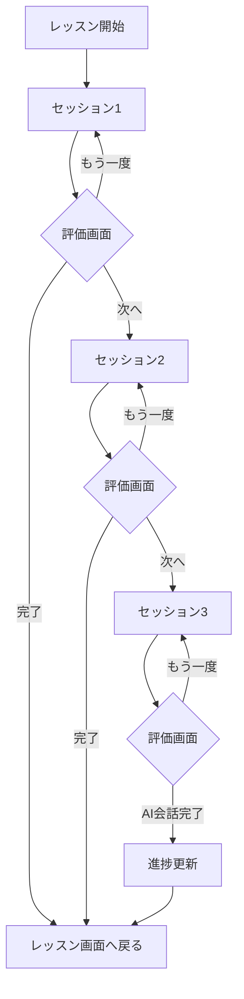

# AI会話実践セッション管理の実装

## 概要
AI会話実践の評価画面において、起動元に応じて異なるボタンを表示し、レッスン内から起動された場合は3つのセッション間を適切にナビゲーションできるように実装しました。

## 実装内容

### 1. 評価画面（AIConversationStructuredReview）の改修

#### 新規パラメータ追加
```dart
class AIConversationStructuredReview {
  final bool isFromLesson;      // レッスンから起動されたか
  final int currentSession;     // 現在のセッション番号(1-3)
  final int totalSessions;      // 総セッション数(3)
  ...
}
```

### 2. ボタン表示の条件分岐

#### ホーム画面から起動した場合（従来の動作）
```
┌─────────────────┬─────────────────┐
│  もう一度練習    │    ホームへ     │
└─────────────────┴─────────────────┘
```

#### レッスンから起動（セッション1,2の場合）
```
セッション 2 / 3 完了

┌─────────┬─────────┬──────────────────┐
│ もう一度 │  完了   │ 次のセッションへ→│
└─────────┴─────────┴──────────────────┘
```

#### レッスンから起動（セッション3完了時）
```
全3セッション完了！

┌─────────────────┬──────────────────┐
│  もう一度練習    │  AI会話を完了    │
└─────────────────┴──────────────────┘
```

### 3. ナビゲーション処理

#### 戻り値による処理分岐
```dart
// AI会話実践画面での処理
final result = await Navigator.push(...);

switch(result) {
  case 'retry':    // もう一度同じセッション
  case 'next':     // 次のセッションへ
  case 'complete': // 途中で完了
  case 'finish':   // 最後のセッション完了
  case true:       // ホーム画面から（従来）
}
```

### 4. セッション管理の流れ



## 技術的詳細

### AIConversationPracticeScreen の変更点

1. **評価画面呼び出し時のパラメータ追加**
```dart
AIConversationStructuredReview(
  // 既存パラメータ
  lesson: widget.lesson,
  sessionFeedback: feedbackData,
  // 新規パラメータ
  isFromLesson: !widget.isSequentialMode &&
                widget.customPromptSettings == null,
  currentSession: currentSessionNumber,
  totalSessions: 3,
)
```

2. **完了処理メソッドの追加**
```dart
void _completeAIConversation() async {
  // AI会話完了をマーク
  await lessonProgressService.markModeAsCompleted(
    mode: PracticeMode.aiConversation
  );

  // ストリーク更新の準備
  // （全アクティビティ完了時にストリーク更新）
}
```

### AIConversationStructuredReview の変更点

1. **_buildActionButtons メソッドの追加**
   - 起動元とセッション番号に応じたボタン生成
   - 3パターンの表示切り替え

2. **セッション進捗の可視化**
   - 「セッション 2 / 3 完了」の表示
   - プログレスインジケーター

## ユーザー体験の改善点

1. **明確な進捗表示**
   - 現在のセッション位置が分かる
   - 残りセッション数が明確

2. **柔軟なナビゲーション**
   - やり直したい場合は「もう一度」
   - 途中でやめたい場合は「完了」
   - 次に進みたい場合は「次のセッションへ」

3. **達成感の演出**
   - 全セッション完了時の特別な表示
   - 「AI会話を完了」ボタンで達成感

## 今後の拡張案

- [ ] セッション難易度の段階的上昇
- [ ] セッション間での学習ポイントの引き継ぎ
- [ ] セッションごとの詳細フィードバック保存
- [ ] 特定セッションのみやり直し機能